<div align="center">

<!-- ══════════════════════════ HERO: LIVE BIAS-SCANNER ══════════════════════════ -->


<br/><br/>

<a href="https://readme-typing-svg.demolab.com">
  
</a>

<br/><br/>

<a href="https://www.linkedin.com/in/fahad-sadiq-khan"></a>
&nbsp;
<a href="mailto:khan.fsadiq05@gmail.com"></a>
&nbsp;
<a href="https://tryistina.net"></a>

</div>

<br/>

## ⚡ The journey

> **Most people finish the degree, then get the job. I got the job in the middle of the degree.**

**`2023` — The spark.** Before university even started, a summer at **Hawks** back home gave me my first taste of real development — a task system that 10×'d a team's weekly throughput. The metric was nice. The addiction was the point. I knew what I wanted to do.

**`2024` — The deep end.** Started **CS & Finance at UofT** and learned the uncomfortable truths early: great systems are won or lost in the *planning* phase, every decision echoes years downstream, and in this field nobody hands you an edge — you out-work everyone for it.

**`2025` — The craft.** In first year I landed at **Concave Tech**, building production Go backends. That's where the field opened up: security isn't a feature, it's a posture — and languages aren't rivals, they're tools forged for different jobs that all have to work together.

**`2025` — The conviction.** Somewhere between shipping and studying, one problem wouldn't leave me alone: *we form our opinions of entire nations from what the internet shows us — not from the people themselves.* So I compiled everything I believed and everything I'd learned into one app. **That's how ISTINA was born.**

**`2026` — The turn.** As second year closed, life changed fast and I had to change cities: Toronto → Montréal. New city, zero network. So I did what I'd been training for — I led myself, and built one from scratch.

**`2026` — The payoff.** That network connected me to **Hadio**, a half-century-old business. They looked at the journey, the portfolio, the shipped code — and hired me full-time to run their development department. **Head of Development. At 20. Mid-degree.**

The pattern behind all of it: learn relentlessly, build real things, and let the work open the doors. **Everything below is the evidence.** ↓

<br/>

<table>
<tr>
<td width="62%" valign="top">

### 🧭 What I actually build

Production-grade systems across the stack — REST APIs, AI/NLP pipelines, computer-vision tooling, and a PID control loop running on bare-metal firmware.

By day I run the **development department at Hadio Friperie Vintage**, shipping everything from internal dashboards to a YOLO/DINOv2 patch-detection pipeline. By night I'm building **ISTINA**, an AI platform that measures bias and framing in news coverage — sentence by sentence.

> 🟢 **Open to collaboration & interesting problems.**

</td>
<td width="38%" valign="top">

### ⚡ At a glance

```text
💼  Head of Dev @ Hadio — at 20
👁️  Founder @ ISTINA AI
🎓  CS & Finance @ UofT
🛠️  Go · Python · C · TS
🤖  AI / NLP / CV pipelines
🔌  ESP32 firmware (r/arduino)
📍  Montréal, QC
```

</td>
</tr>
</table>

<br/>

<div align="center">

### 🧰 Arsenal


<br/>


</div>

<br/>

##  &nbsp;Featured — *Signal in the noise.*

> An AI platform that ingests RSS feeds and analyzes **geopolitical news at the sentence level** — surfacing rhetorical bias, narrative framing, and conflicting claims across coverage of the same event, then turning that analysis into shareable content.

🔗 **[tryistina.net](https://tryistina.net)** &nbsp;·&nbsp; 🔒 *Source private (security)* &nbsp;·&nbsp; 🎯 *B2B: journalism schools, fact-checkers, newsrooms*

| Layer | Stack |
|---|---|
| 🖥️ &nbsp;Backend | `FastAPI` · `Python` · `JWT auth` · Dockerized |
| 🎨 &nbsp;Frontend | `React` · `TypeScript` · `Vite` · `TailwindCSS` |
| 🗄️ &nbsp;Data & Auth | `Supabase` · `PostgreSQL` |
| ▲ &nbsp;Deploy | Backend on `Fly.io` · frontend on `Vercel` |
| 🤖 &nbsp;Engine | LLM-driven sentence-level bias scoring · framing detection · multi-stage claim verification |
| 🔁 &nbsp;Pipeline | `n8n`: RSS → scorer → analyzer → claim verifier → generator, with `Tavily` live search |

<details>
<summary><b>🦀 The origin story → ISTINA v1 (Rust CLI)</b></summary>

<br/>

The prototype the platform grew out of: a **Rust** command-line engine that ingests live RSS feeds, normalizes articles into structured models, and runs AI-powered bias detection to compare narratives across sources.

| | |
|---|---|
| **Language** | Rust |
| **Design** | Clean architecture — MVC + Command, Factory, Visitor, Repository patterns |
| **Persistence** | Pluggable: in-memory · JSONL · database-ready |
| **Does** | RSS ingestion · narrative conflict tracking · bias reports with confidence scores |

*Source private; shown here as the foundation of the current platform.*

</details>

<br/>

## 📂 Public Projects

<table>
<tr>
<td width="50%" valign="top">

#### 🔧 [concave-tech](https://github.com/mufferio/concave-tech)


Layered REST API serving user data from PostgreSQL via Gin. Clean controller / service / repository / DTO separation, Docker Compose for local Postgres + pgAdmin.

</td>
<td width="50%" valign="top">

#### 👾 [SOTD Engine](https://github.com/mufferio/SOTD-riscv-assembly-engine)


Survival-horror game written **entirely in RISC-V assembly**. Infinite undo (512-snapshot ring buffer), Chebyshev-distance monster AI, and a multiplayer leaderboard.

</td>
</tr>
<tr>
<td width="50%" valign="top">

#### 🗜️ [file-compression-engine](https://github.com/mufferio/file-compression-engine)


Quadtree-based lossy image compressor. Recursively partitions images by regional variance into a custom `.qdt` format — ~5× size reduction at moderate loss.

</td>
<td width="50%" valign="top">

#### ✈️ [frequent-flyer-data-parser](https://github.com/mufferio/frequent-flyer-data-parser)


Airline sim ingesting tens of thousands of CSV rows into a typed domain model with frequent-flyer tier logic, plus an interactive map with real-time filtering.

</td>
</tr>
<tr>
<td width="50%" valign="top">

#### ♟️ [othello-java-engine](https://github.com/mufferio/othello-java-engine)


Full Othello/Reversi engine with 8-direction move validation, random + greedy AI strategies, and automated simulation modes. JUnit-tested, Maven-built.

</td>
<td width="50%" valign="top">

#### 🎨 [paint3d-mario-edition](https://github.com/mufferio/paint3d-mario-edition)


Themed JavaFX paint app showcasing MVC + Observer, Strategy-per-tool routing, and a shape Factory. 7 tools, undo/redo, clipboard ops, PNG import/export.

</td>
</tr>
<tr>
<td width="50%" valign="top">

#### 📝 [paint3d-visitor-fsm-parser](https://github.com/mufferio/paint3d-visitor-fsm-parser)


Companion project focused on persistence: a custom save-file format with an FSM-style, regex-driven parser, backed by a JUnit suite defining the parser contract.

</td>
<td width="50%" valign="top">

#### ☕ [esp32-espresso-mod](https://github.com/mufferio/esp32-espresso-mod)


**"Frank"** — a PID temperature-controller mod holding ±0.5 °C at target. ESP32 + thermocouple + SSR, self-hosted web UI at `frank.local`. *Featured on r/arduino.*

</td>
</tr>
</table>

<br/>

## 💼 Experience

**Head of Development (Full-time)** · *Hadio Friperie Vintage* &nbsp;|&nbsp; `Present`
Started as a contractor; hired full-time to lead the development department — **at 20, mid-degree**. Own the entire technical footprint of a retail business: internal admin dashboards (React/Fastify/Supabase), an employee portal, a YOLO/DINOv2 computer-vision patch-detection pipeline, and automation across operations.

**Software Developer** · *Concave Tech* &nbsp;|&nbsp; `05/2025 – 08/2025`
Built a production-grade user-service backend in **Go** with RESTful APIs for secure user-data ingestion and validation. Implemented hashing + salting for credential storage, integrated **PostgreSQL** with indexed schemas for scalable concurrent queries, and containerized with **Docker** — cutting auth-related failures by **~40%**.

**Software Engineer** · *Elections Ontario* &nbsp;|&nbsp; `01/2025 – 02/2025`
Led on-site technical operations during the Ontario Provincial Election, keeping voting infrastructure fully operational under strict time pressure. Verified large volumes of voter records and resolved **95%+ of technical issues on first response**, preventing downtime in a compliance-driven environment.

**Software Engineer** · *Hawks Management & Solutions* &nbsp;|&nbsp; `06/2023 – 08/2023`
Built a **Python**-based task delegation and tracking system with a cross-functional team. Automated assignment logic and real-time progress tracking that boosted weekly task throughput **10×**, refined through iterative testing and structured user feedback.

<br/>

<div align="center">

## 📊 GitHub


<br/><br/>


<br/><br/>


<br/><br/>

<!-- ══════════════════════════ SNAKE ══════════════════════════ -->


<br/><br/>

🎓 **Honors BSc & BCom, Computer Science and Finance @ University of Toronto** &nbsp;·&nbsp; 2024–present

<sub><code>$ exit 0</code> — thanks for scrolling.</sub>

</div>
